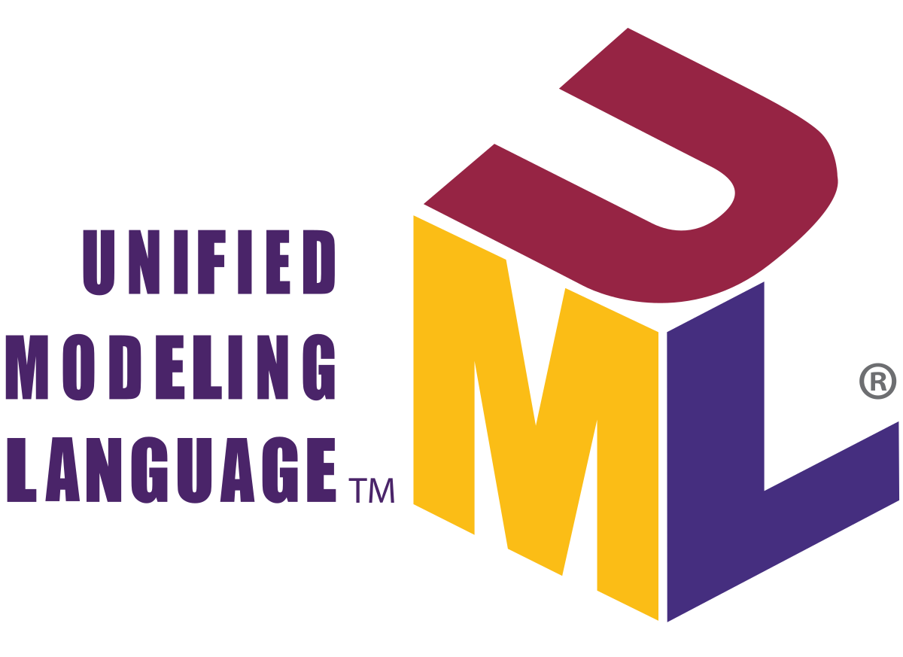
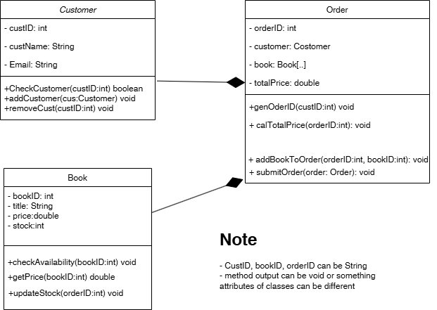
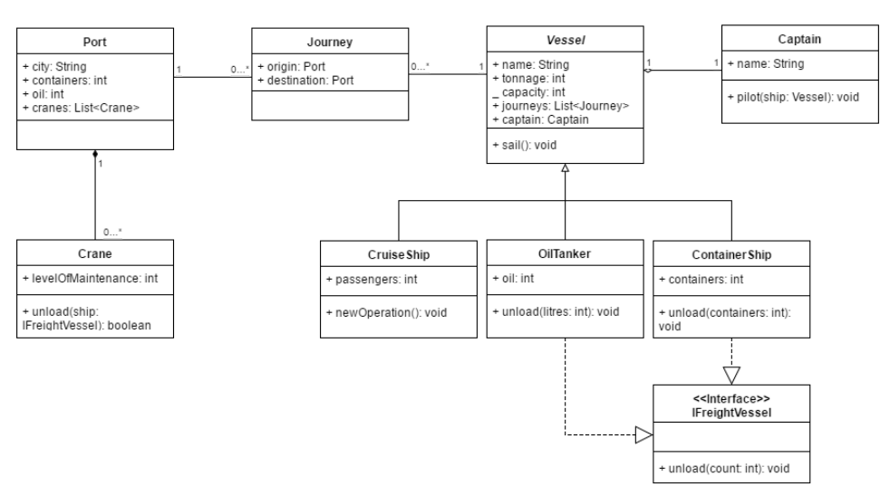

Lab - UML
==========

Before you start
----------
The purpose of this lab is to practice how to creat UML diagram.
For creating and modifying UML diagrams, there are different tools available online. You may use any tool you like to draw diagrams in this course. you can use [Draw.io](https://www.draw.io/​)

You can export the image as a file and put into this project. Then, please use git markup to insert the diagram's image below each exercise in this Reademe file such as 

```

```
 where logo.png is located in image folder under this project.


Exercise One - Simple Sphere
--------------------
**OBJECTIVE**
- To analyze a problem using object-oriented analysis.
- To design UML diagrams such as class diagram, use case diagram, and deployment diagram.
- To draw the class diagram, use case diagram, and deployment diagram.

Requirements:BookStore Inc. is a growing business that sells books through its own physical store. Due to increasing demand, the company wants to introduce an online ordering system. 
You have been assigned to design this new system.

The company wants to allow customers to browse and purchase books online. After an order is placed, the system must check book stock and assign available books to the order. 
If an item is out of stock, the system will notify the customer and place the order on hold until the book is restocked. The company accepts payments via credit card, PayPal, and bank transfers.
Based on the above requirements, draw the complete class diagram, list lcasses, attributes and methods.

*Class Definitions:*

*Customer:*
- Check Customer: Receives customer ID as input and returns a boolean indicating if the customer is valid.
- Add Customer: Adds a new customer, receiving a customer object as input.
- Remove Customer: Deletes a customer based on customer ID.

*Order:*
- Generate Order ID: Creates a new order with input as Customer.
- Calculate Total Price: Computes total price for an order given an order ID.
- Add Book to Order: Adds a book to an order. Inputs: Order ID, Book.
- Submit Order: Finalizes an order, receiving Order as input.

*Book:*
- Check Availability: Verifies stock availability for a book.
- Get Price: Retrieves the price of a book.
- Update Stock: Updates book stock when an order is placed.

**Put your class diagram below.**




Exercise Two: Class Associations & Multiplicities
-----------------------------
Create a simple class diagram, with associations and multiplicities, for the following
scenarios:
1. Lecturers teach ​ Courses ​ . Each lecturer has a name, and a list of courses they are
teaching, which can be zero or more. Each course has a name, a course number,
and a room. A course must be taught by exactly one lecturer.
2. Libraries have ​ Books ​ . Each library has a name, location, and a list of books. The
library has ​ more than 1000 books. Each book has a name, a genre, and the library it
belongs to. Each book belongs to exactly one library.

**Put your class diagram below.**

Exercise Three: Understanding UML Diagrams
------------------------------



With the UML diagram above, please answer the questions below:
1. What classes have an association relationship?
2. What classes have an aggregation relationship?
3. What classes have a composition relationship?
4. Which classes implement an interface?
5. Which classes are subclasses of another class?
6. What attributes does the OilTanker class have?
7. What is the multiplicity between Port and Journey?
8. What reference types can be used to refer to a ContainerShip object?


```
Answers here
```

Lab - Object-oriented Concepts (Repeat)
==========

Before you start
----------
The purpose of this lab is to give a practice of how to implement the source in object-oriented concepts including inheritance and polymorphism.

Exercise Four - Ecommerce Shoping cart
--------------------------------
 The following two interfaces specify the functions that a Book and a Electronic product are expected to have (This exercise does not require Code space to do):

```java
public​ ​ interface​ ​ Product ​ ​ {
	String getName();
        double getPrice();
	double getTotalprice();
}

interface Discountable {
    double getDiscount();
    double getTotalprice();
}
```
For the following two classes write down the methods that they must implement.

```java
public​ ​ class​ ​ Book​ ​ implements​ ​ Product​ ​ {
    private String name;
    private double price;
   
    // TODO Implement the necessary methods

}
public​ ​ class​ ​ Electronic ​ ​ implements​ Product, Discountable  ​ {
    private String name;
    private double price;
    private double discount;
    // TODO Implement the necessary methods


}
```

Which of the following lines are valid?
1. Product​  p2 ​ = ​ ​ new​ ​ Book​ ();
2. Discountable​ p3 ​ = ​ ​ new​ ​ Electronic​ ();
3. Electronic​ p4 ​ = ​ ​ new​ ​ Discountable​ ();
4. Product​ p5 ​ = ​ ​ new​ ​ Discountable​ ();

```
Your answers
```


Exercise Five - Animals
---------------------------
The source code of this exercise is in *lab.oodp.ood.animals*. The following interface specifies the functions that ​ IAnimal ​ is expected to perform:

```java
public​ ​ interface​ ​ IAnimal​ ​ {

	// Returns a string containing the greeting
	public​ ​ String​ sayHello​ ();
	
	// Returns true or false;
	public​ ​ boolean​ isMammal​ ();
	
	// Returns the name, followed by "the" followed by the
	// animal type, e.g. "George the Monkey"
	public​ ​ String​ myName​ ();
	
	// Returns the number of legs
	public​ ​ int​ legCount​ ();
}
```

Here is an example output of the application:

```
Tweety the bird says tweet tweet.
Tweety the bird is a non-mammal.
Did I forget to tell you that I have 2 legs.
--------------------------------------------------------------
Bruno the dog says woof woof.
Bruno the dog is a mammal.
Did I forget to tell you that I have 4 legs.
--------------------------------------------------------------
Mr. Ed the horse says neigh.
Mr. Ed the horse is a mammal.
Did I forget to tell you that I have 4 legs.
This is a famous name of my animal type: PharLap
--------------------------------------------------------------
```
Pleaes complete the following:
- Complete the ​ **Bird** ​ and ​ **Dog** ​ classes that implement the interface ​ *IAnimal*​.
:sparkles: *Hint: On VSCode, you can automatically generate override methods. Instruction is [here](https://code.visualstudio.com/docs/java/java-refactoring#_overrideimplement-methods)* 
- Complete the **Horse** ​ class that implements the interface ​ *IAnimal* ​ and another interface ​ *IFamous ​ which will be used to tell the user about the famous horse ​ "PharLap"​.
- Create a simple application and call the method ​ processAnimalDetails(IAnimal[]
list) which iterates through an array of animals and gives the example output. Note that
this method will call ​ myName​ , ​ sayHello​ , ​ isMammal​ , and ​ legCount ​ for each one of the
animals. We also like to print famous names of animals if they exist. 
:sparkles: *Hint: use ​ `instanceof` operator.*

**Don't forget to push the code**

